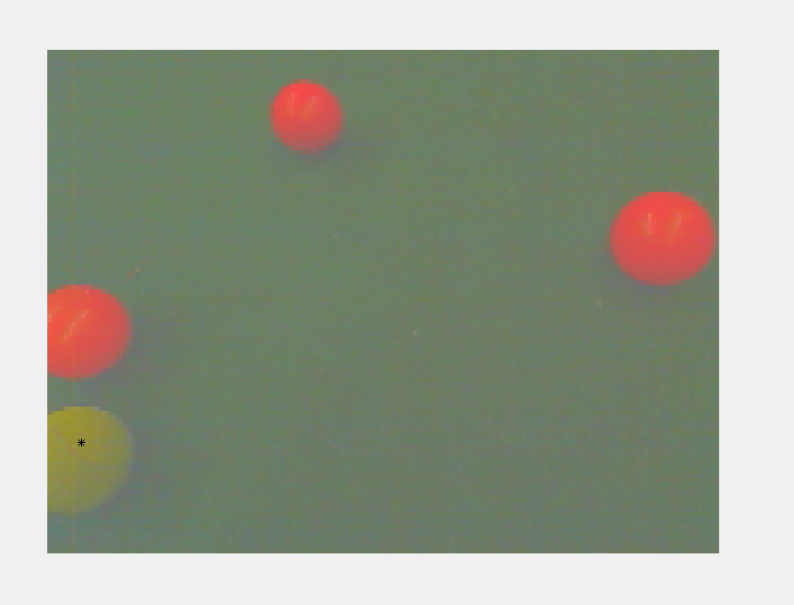

## Ball Detection using Gaussian MLE
### Dhruv Ilesh Shah

There can be multiple ways of detecting a ball in a background, and depending on the scenario, various simple algorithms can be used. Here, we demonstrate an algorithm that can be used without having to calibrate thresholds or color means directly, but train the model by interactive user input. The model estimates multivariate Gaussian using MLE and then uses them to identify similar structural ball in unseen images.

*Software Used:* Matlab R2015b (Unfortunately; The basics, however, are simple and can be easily implemented in Python/C++)

### How to Use
The `example_rgb.m` script loads the images one by one with the `roipoly` function in Matlab to allow interactive selection of polygonal regions of interest in the image. Select the required sections in the image; here, a yellow/green ball. Repeat this for as many balls as you wish, improving the quality of the dataset.

Then on, run `gaussian_mle.m` to generate the estimates for _mu_ and _sigma_ for the generated dataset. Create an image *I* which stores the image which has to be analysed for presence of the ball. Then run the script `detect_ball.m` to identify potential locations. You can tweak the values of R, N in the structural element and threshold in the last script for fine tuning.

_(I understand that making functions for each task and having a main script would've been more convenient, but I made this in a hurry and then got lazy to organise everything. Please bear with me!)_

### Results

Below are some of the results obtained.

_Data taken from University of Pennsylvania's online course on 'Robotics: Estimation and Learning'_
